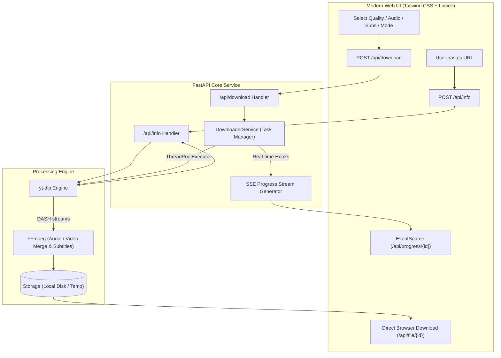

<div align="center">

# 🎬 Universal Media Downloader

**A high-performance, self-hosted universal media downloader and audio extractor web application.**  
Powered by **FastAPI**, **yt-dlp**, and **FFmpeg** with concurrent multi-task downloads, dynamic real-time progress tracking, 8K/4K resolution support, customizable subtitles, and dual delivery modes.

<p align="center">
  
  
  
  
  
  
</p>

</div>

---

## 📑 Table of Contents

- [Overview](#-overview)
- [✨ Key Features](#-key-features)
- [🏗 Architecture & Workflow](#-architecture--workflow)
- [🚀 Getting Started](#-getting-started)
  - [Prerequisites](#prerequisites)
  - [Local Installation](#local-installation)
  - [Docker & Docker Compose](#docker--docker-compose)
- [📡 API Reference](#-api-reference)
- [📁 Project Structure](#-project-structure)
- [🧪 Running Tests](#-running-tests)
- [⚙️ Configuration](#️-configuration)
- [📋 Live Logging](#-live-logging)
- [🛡 Disclaimer & License](#-disclaimer--license)

---

## 🌟 Overview

**Universal Media Downloader** is an all-in-one media extraction suite designed for simplicity, speed, and reliability. It provides a sleek, responsive web interface backed by an asynchronous FastAPI server that can process video and audio streams from **over 1,000 websites**—including YouTube, Instagram, Facebook, TikTok, Twitter/X, Reddit, Vimeo, and Twitch.

Whether you need an **8K HDR video with embedded multi-language subtitles** or a **320kbps MP3 audio file with embedded album artwork**, Universal Media Downloader handles stream separation, quality sorting, FFmpeg merging, and file delivery seamlessly.

---

## ✨ Key Features

### 🌐 Universal Platform Support
- **YouTube**: Videos, Shorts, Playlists, Live Stream archives.
- **Instagram**: Reels, Stories, Video posts.
- **Facebook**: Watch, Reels, public video links.
- **TikTok**: HD videos, audio slides.
- **Twitter / X**: Embedded video tweets.
- **Reddit, Vimeo, Twitch, Bilibili**, and generic web pages with embedded HTML5/HLS/DASH media.

### 📺 High-Resolution Video & Smart Merging
- Download in true **8K (4320p)**, **4K (2160p)**, **2K (1440p)**, **Full HD (1080p60)**, **720p**, and custom resolutions.
- Automatic DASH video + best audio stream extraction and losslessly merged via **FFmpeg**.
- Quality fallbacks ensure you always receive the highest possible fidelity.

### ⚡ Concurrent Multi-Task Download Manager
- **Simultaneous Downloads**: Queue and download multiple media files concurrently without blocking the server.
- **Interactive Task Cards**: Each download receives its own live card showing progress percentage, real-time download speed (`MB/s`), dynamic ETA countdown, and file sizes.
- **Task Control & Instant Cancellation**: Cancel running downloads instantly with automatic disk cleanup of partial/temporary files (`.part`, `.temp`, `.ytdl`).
- **One-Click Cleanup**: Dismiss individual cards or clear all completed tasks with a single click.

### 💬 Comprehensive Subtitles & Closed Captions
- **Auto-Detection**: Discovers both official creator subtitles and auto-generated captions in all available languages.
- **3 Delivery Modes**:
  - **Embedded Soft Subtitles**: Multiple switchable subtitle tracks embedded directly into `.mp4` or `.mkv` containers (selectable in players like VLC, IINA, MPV).
  - **Burned-In Hard Subtitles**: Hardcoded permanently into video frames using FFmpeg subtitle filters.
  - **Separate Subtitle Files**: Auto-extracted `.srt` / `.vtt` caption tracks.
- **Rate-Limit Resilience**: Automatic retry and graceful degradation if platform caption APIs are rate-limited.

### 🎵 High-Fidelity Audio Extraction
- Convert any video to **320kbps MP3**, **M4A (AAC)**, **WAV**, or **FLAC**.
- Automatic **ID3 metadata tagging** (Title, Artist/Uploader, Album) and **cover art thumbnail embedding**.

### 💾 Dual Storage & Delivery Modes
- **Browser Download (Cloud & Local)**: Delivers files directly to the client browser with RFC 6266 & RFC 5987 UTF-8 safe `Content-Disposition` headers.
- **Local Machine Folder Save**: Direct filesystem write to custom local directories (e.g., `~/Downloads`, `~/Videos`, or any custom path) with instant path validation and host file manager integration (`xdg-open` / `open` / `start`).

### 📦 Zero-Config FFmpeg Engine
- Bundled with `static-ffmpeg` fallback: Works out of the box even if FFmpeg is not installed on your host system.

---

## 🏗 Architecture & Workflow



---

## 🚀 Getting Started

### Prerequisites

- **Python 3.10+**
- (Optional) **FFmpeg** (Recommended, but `static-ffmpeg` will be automatically used if system FFmpeg is absent).
- (Optional) **Node.js** (Optional JavaScript runtime for specific platform extractors).

---

### Local Installation

#### 1. Clone the repository
```bash
git clone https://github.com/zexhan17/universal-media-downloader.git
cd universal-media-downloader
```

#### 2. Create and activate a virtual environment
- **Linux / macOS:**
  ```bash
  python3 -m venv venv
  source venv/bin/activate
  ```
- **Windows (Command Prompt / PowerShell):**
  ```cmd
  python -m venv venv
  venv\Scripts\activate
  ```

#### 3. Install dependencies
```bash
pip install -r requirements.txt
```

#### 4. Run the application
```bash
python3 run.py
```

Open your browser and navigate to:  
👉 **`http://localhost:8000`**

---

### Docker & Docker Compose

Deploy Universal Media Downloader in seconds using Docker:

#### Using Docker Compose (Recommended)
```bash
docker compose up -d --build
```

#### Using Docker CLI
```bash
# Build Docker image
docker build -t universal-media-downloader .

# Run container with persisted downloads folder
docker run -d \
  --name yt-downloader \
  -p 8000:8000 \
  -v $(pwd)/downloads:/app/downloads \
  --restart unless-stopped \
  universal-media-downloader
```

The service is available on `http://localhost:8000` (or `http://<your-server-ip>:8000`).

---

## 📡 API Reference

Universal Media Downloader exposes a clean RESTful & Server-Sent Events API:

| Endpoint | Method | Description |
|---|---|---|
| `/api/info` | `POST` | Extract video metadata, resolutions, formats, and available subtitle tracks. |
| `/api/download` | `POST` | Create and enqueue a new media download task. |
| `/api/tasks` | `GET` | List all active, queued, and completed download tasks. |
| `/api/task/{task_id}` | `GET` | Get current status and details for a specific task. |
| `/api/task/{task_id}/cancel` | `POST` | Cancel active download immediately and delete partial/temporary files. |
| `/api/task/{task_id}` | `DELETE` | Dismiss/delete task and associated files. |
| `/api/progress/{task_id}` | `GET` | Server-Sent Events (SSE) live progress stream. |
| `/api/file/{task_id}` | `GET` | Stream or download the finalized media file (RFC 5987 compliant). |
| `/api/history` | `GET` | Retrieve list of completed download history. |
| `/api/history` | `DELETE` | Clear download history records. |
| `/api/system-paths` | `GET` | Get common user directory suggestions (`~/Downloads`, `~/Videos`, etc.). |
| `/api/validate-path` | `POST` | Validate custom destination folder path and write permissions. |
| `/api/open-folder` | `POST` | Open downloaded folder in host system file explorer (`xdg-open` / `open` / `start`). |

---

### API Request Examples

#### 1. Fetch Video Metadata (`POST /api/info`)
```bash
curl -X POST http://localhost:8000/api/info \
  -H "Content-Type: application/json" \
  -d '{"url": "https://www.youtube.com/watch?v=dQw4w9WgXcQ"}'
```

#### 2. Start a Download Task (`POST /api/download`)
```bash
curl -X POST http://localhost:8000/api/download \
  -H "Content-Type: application/json" \
  -d '{
    "url": "https://www.youtube.com/watch?v=dQw4w9WgXcQ",
    "quality": "1080p",
    "container": "mp4",
    "subtitles_enabled": true,
    "subtitle_langs": ["en"],
    "subtitle_mode": "embed",
    "save_mode": "browser"
  }'
```

---

## 📁 Project Structure

```
universal-media-downloader/
├── app/
│   ├── api/
│   │   └── routes.py           # REST API endpoints & SSE stream handlers
│   ├── services/
│   │   ├── downloader.py       # DownloaderService, yt-dlp hooks, task manager
│   │   └── progress.py         # Progress state data models & helpers
│   └── main.py                 # FastAPI initialization, logging middleware, static mounting
├── static/
│   ├── css/
│   │   └── styles.css          # Custom styling, animations, responsive design
│   ├── js/
│   │   └── app.js              # Frontend UI controller, SSE listener, task manager
│   └── index.html              # Main single-page interface (Tailwind CSS + Lucide)
├── tests/
│   └── test_app.py             # Integration & unit test suite (pytest + FastAPI TestClient)
├── downloads/                  # Output directory for processed media files
├── docker-compose.yml          # Compose specification for containerized deployment
├── Dockerfile                  # Multi-stage production container definition
├── requirements.txt            # Python dependencies
├── run.py                      # Application launcher script with static-ffmpeg init
├── server.log                  # Real-time request/response diagnostic log
└── README.md                   # Project documentation
```

---

## 🧪 Running Tests

The test suite includes comprehensive tests for API routes, path validation, unicode filename safety, task cancellation, partial file cleanup, and download manager endpoints.

Run the test suite with:

```bash
PYTHONPATH=. pytest -v
```

---

## ⚙️ Configuration

You can customize the host and port via environment variables:

| Variable | Default | Description |
|---|---|---|
| `HOST` | `0.0.0.0` | Server bind IP address |
| `PORT` | `8000` | Server listening port |

**Example:**
```bash
PORT=5000 python3 run.py
```

---

## 📋 Live Logging

Universal Media Downloader features automated request and response logging. Every incoming API request, execution duration, and response code is captured in real-time in `server.log`:

```
============================================================
🚀 Universal Media Downloader Server Log
Started at: 2026-09-10 16:38:00
============================================================

[2026-09-10 16:38:05] [INFO] [app.server]: 👉 [REQUEST] POST /api/info (from 127.0.0.1) | Body: {"url": "https://..."}
[2026-09-10 16:38:06] [INFO] [app.server]: 👈 [RESPONSE] POST /api/info | Status: 200 | Duration: 412.3ms
[2026-09-10 16:38:10] [INFO] [app.server]: 👉 [REQUEST] POST /api/download (from 127.0.0.1) | Body: {"quality": "1080p", ...}
[2026-09-10 16:38:10] [INFO] [app.server]: 👈 [RESPONSE] POST /api/download | Status: 200 | Duration: 3.2ms
```

To watch logs live in your terminal:
```bash
tail -f server.log
```

---

## 🛡 Disclaimer & License

### Disclaimer
This software is intended for personal archiving, educational, and backup purposes. Please respect copyright laws and the terms of service of the content platforms you interact with. Only download media that you have the right or permission to access and archive.

### License
This project is open-source and released under the **[MIT License](LICENSE)**.
